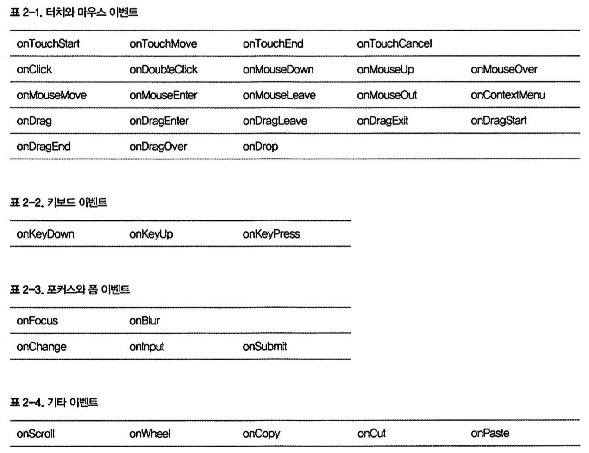

## Chapter 2, DOM 추상화의 내부

### 리액트의 이벤트
액트가 이벤트 핸들러를 노드 자체에 연결하는 것은 아니다.
실제로는 **단 하니의 이벤트 리스너**가 **문서루트**에 연결되며,
이벤트가빌쟁하면 리액트가 이를 적절한 컴포넌트요소로 매핑한다.
또한 리액트는 이벤트 리스너가 언마운트될 때 자동으로 이를 제거한다.

### DOM 이벤트 리스너
HTML은 태그 특성을 위한 간단히고 이해하기쉬운 이벤트 처리API(onclick,onfocus등)를 제공한다.
하지만 리액트의 속성에는 낙타 표기법(~~onclick~~이 아닌**onCIick**)이 적용된다.



이벤트 리스너 등록의 예

1. 람다 표현식으로 함수를 바로 적용할수 있다.

```jsx
<div className='card__title'; onClick={
  ()=>this.setState({ showDetails: !this.state.showDetails })
}>
```

2. 함수의 레퍼런스를 넘길수 있다.

```jsx
class Card extends Component {

  toggleDetails(){
    this.setState({ showDetails: !this.state.showDetails });
  }

  render() {
   return (
     <div className='card__title'; onClick={this.toggleDetails.bind(this)}>
       {thiS.props.title}
     </div>
   )
  }
}
```

### JSX 자세히 실펴보기

다음 코드는
```jsx
<hl>Hello World</hl>
```
다음과 같이 변환된다
```jsx
ReactCreateEIement("hl", null,"HelloWorld");
```

#### JSX와HTML의 치이

JSX로 HTML 구문을 작성할 때는 세 가지 중요한 측면을 기억해야 한다.

1. 태그 특성은 낙타 표기법으로 작성한다. `oOoOoOoOoOo`
2. 모든 요소는 짝이 맞아 한다. `<짝 /> <짝>꿍</짝>`
3. 특성 이름이 HTML언어 사양이 아닌 DOM API에 기반을 둔다. `document.getE1ementById("box").className="some-other-class"`

#### JSX의 특이점

리액트 컴포넌트는 단일 루트 노드만 렌더링할 수 있다.
```jsx
return (
  <h1>Hello World</h1>
)
```

아래 코드는 유효하지 않음.

```jsx
return (
  <h1>Hello World</h1>
  <h2>Have a nice day</h2>
)
```

위 코드는 `<div/>`로 감싸면 다시 유효한 코드가 된다.
```jsx
return(
  <div>
    <hl>HelloWorld</hl>
    <h2>Have a nice day</h2>
  </div>
)
```

이러한 특성은 javascript은 return은 하나의 값만 반환 할수 있기 때문이다.

```jsx
return React.EreateEIement("div", null,
  React.createEIement("h1", null, "HelloWorld"),
  React.createEIement("h2", null, "Have a nice day"),
)
```

#### 만약은 안된다!

JSX안에 if문은 들어갈수 없다. 이런건 자바스크립트 같지만 html같은 느낌이 있음.
```jsx
<div className={if(condition){"salutation"}}>HelloJSX</div>
```

위 코드를 javascript로 compile하면
```jsx
React.createElement("div",{className: if(condition){"salutation"}}, "Hello JSX");
```

객체 리터럴 `{}`안에 if문이 들어가는 기이한 현상이 벌어진다.

#### 근데 왜 삼항 연산은 된댜?

```jsx
render(){
  return(
    <div className={condition ? "salutation" :""}>
      Hello JSX
      </div>
  )
}
```
이건 유효한 javascript 문법으로 변하기 때문이다.

```jsx
React.createElement("div",{className:condition ? "Salutation":""}, "Hello JSX");
```

이걸로 안되겠다 싶으면 return 앞에 jsx문법 바깥쪽에 선언하면 되부러.

```jsx
render(){
  let className;
  if(condition){
    className = "salutation";
  }
  return(
    <div className={className}>Hello JSX</div>
  )
}
```

뭐 늘한던거다. if 없인 못살아.~

#### 공백
기본적으로 공백을 출력하지 않는다. 따로 선언을 줘야한다.
```jsx
return(
  <div>
    <a href="http://google.com">Google</a>{" "}
    <a href="http://facebook.com">Facebook</a>
  </div>
)
```

&nbsp 안먹더라...

#### JSX의 주석
사실 주석 어떻게 쓰는지 몰라도 된다.
언제나 인텔리J가 나에게 코딩을 가르친다.

인텔리J가 빨간색은 틀린거고 주황색 경고가 있으면 내가 짠 코드보다 그 녀석은 더 좋은걸 알고 있는거다.
내가 모르는걸 알려주는 가장 좋은 1:1 과외 선생님이다.
그냥 OSX 기준으로 주석을 원하는 부분에서 `Cmd + /` 버튼 누르자.

알아서 코멘트가 만들어 질것이다. 그 다음에 인텔리J가 알려준 문법을 배우면 되는것이다.

#### HTML 바로 주입하기
HTML을 바로 주입하는건 위험(danger)하다.
하지만 세상사 위험한 일을 안하고 살기 쉽지 않다.

그 어려운 일을 하기 위해서는 `dangerouslySetInnerHTML`을 사용하면 해낼수 있다.
```jsx
<span dangerouslySetInnerHTML={{__html:this.props.someHtml}}/>
```

#### `React.DOM`에 고급진 돔을 만들수 있는 팩토리가 있다.
